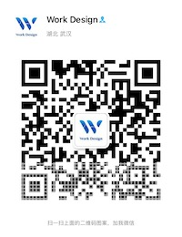

# Work Design

Work Design 致力于产业互联网的基础生态建设，主要做以下几件事：

* 软件研发生态：
  * 方法论：如何以更低成本、更高效率开发互联网应用；
  * 技术生态共享：理论指导实践，开放源码，技术选型的思考；
  * 开发人员灵活雇佣；
* 运营服务生态：
  * 公域流量：
  * 私域流量：

Work Design 希望在当下数字化成本居高不下的时代，抹平传统中小企业面对数字化转型的“贫富差距”。

通过一套融合了技术体系、商业模式、运营方法、团队治理的整合方案，减少传统企业在实践数字化过程中的成本，帮助他们少走弯路。

## 业务组件化

Work Design 是业务组件化的先驱，我们首先提出了"业务组件化"这个概念。将现实中复杂多变的业务需求归纳为有限的业务模块，再针对具体的业务进行模型的属性加减，交互的加减，从而达到业务场景实际优化。

这个思路很类似于中医中的辩证论证，通过辩证确定主方之后，考虑患者的体质等因素加减药物。

Work Design 的业务组件涵盖了大量的常规需求。基于这些组件，遵循[开发指南](%E6%8A%80%E6%9C%AF%E4%BD%93%E7%B3%BB/%E6%9C%AC%E5%9C%B0%E5%BC%80%E5%8F%91%E6%8C%87%E5%8D%97.md)，针对企业的个性化需求适配开发，即可实现快速上线。

## 全产业链及多场景

鉴于在软件研发效率上的突破，我们更倾向于开发打通上下游的全产业链业务系统。这样做的意义：

* 打破数据孤岛；
* 减少软件的使用和学习成本；

鉴于所有的商业活动大都是基于人类的社交活动，所以默认我们对微信生态下的公众号、企业微信、微信支付进行了集成。

## [商业模式](%E5%95%86%E4%B8%9A%E6%A8%A1%E5%BC%8F)

技术本质上是生产力工具，最终服务于商业目标。Work Design 作为业务组件化的开拓者，在开发之初，必然要对所追求的商业目标深入理解，除了通过系统实现商业目的，也是在指导开发工作。

Work Design 的商业目标是：

* 全产业链，打通上下游，也就是说围绕项目主体，无论是供应链、还是消费者、还是员工（服务者）都将围绕 Work Design 打造的系统展开工作；
* 技术普惠，技术要实现价值最大化，在于提升整个社会的生产力，而不是作为少数企业垄断市场的手段；
* 渐进式数字化。

基于上述目标，Work Design 的技术体系要达到的目标：

* 尽可能降低开发成本，一方面是实现同样的功能，Work Design 的代码量明显低于同行
* 尽可能降低从业人员门槛，降低开发者的学习成本，让开发者在尽可能掌握少量知识的前提下即可稳定地开展工作，或者基于开发者已有的知识。

## [技术体系](技术体系)

Work Design 技术体系是企业开展软件研发的方法论，追求低成本，高效率。基于一套快速开发体系发展而来，由以下几部分组成：

* 软件快速开发体系，基于公认效率最高的 Web 全栈开发框架：[Ruby On Rails](https://github.com/rails/rails) ，相对常规 Rails 开发提升 2 \~ 3 倍效率（基于代码总量判断）；
  * 业务组件化：通用功能组件化，开箱即用，进一步提升 5 \~ 10 倍开发效率；
  * 低代码化：通用的业务只用定义模型即可，会自动生成页面，再一步提升了数倍开发效率；
* 追求效率的协作方式：
  * 打破传统的 产品 -\> 设计 -\> 开发 -\> 测试 的实施流程，避免各岗位工作阻塞，尽可能减少各个环节传递过程中的沟通成本和损耗；
  * 更加体系化的管理，从产品原型、设计、开发都是遵循组件化的策略进行架构；

#### 架构理念

* [最佳实](%E6%8A%80%E6%9C%AF%E4%BD%93%E7%B3%BB/%E6%9C%80%E4%BD%B3%E5%AE%9E%E8%B7%B5.md)
* 灵活，易于扩展，Override
* [减少重复工作造成的浪费]()
* [全链条]()
* [约定优于配置](%E6%8A%80%E6%9C%AF%E4%BD%93%E7%B3%BB/%E7%BA%A6%E5%AE%9A%E4%BC%98%E4%BA%8E%E9%85%8D%E7%BD%AE.md)
* [工具优于约定](%E6%8A%80%E6%9C%AF%E4%BD%93%E7%B3%BB/tools.md)
* [前后端“分离”](%E6%8A%80%E6%9C%AF%E4%BD%93%E7%B3%BB/%E5%85%A8%E6%A0%88%E6%96%B9%E6%A1%88.md)

#### 原理

* [降低数字化成本，实现技术普惠](%E6%8A%80%E6%9C%AF%E4%BD%93%E7%B3%BB/why_build_self.md)
* [工具](%E6%8A%80%E6%9C%AF%E4%BD%93%E7%B3%BB/tools.md)：优化工具，提升生产力，除了通用的功能及组件，我们也对一些工具进行了优化，比如表单构建工具。
* [模块化](%E6%8A%80%E6%9C%AF%E4%BD%93%E7%B3%BB/%E6%A8%A1%E5%9D%97%E5%8C%96%E5%BC%80%E5%8F%91.md)：我们将通用的功能进行了抽取，以 Rails Engine 的形式附加到主项目即可快速应用某块功能；
* [体系化]()：基于统一的设计理念，UI体系，一致性。
* [语言是生产力](%E6%8A%80%E6%9C%AF%E4%BD%93%E7%B3%BB/%E5%87%BD%E6%95%B0%E5%BC%8F%E5%92%8C%E9%9D%A2%E5%90%91%E5%AF%B9%E8%B1%A1.md)

#### 技术原则

技术架构和选型遵循以下原则：

* 尽可能减少技术栈，比如我们并没有引入诸如Vue, React这类的前端框架，而只是采用了基本的HTML、CSS、Javascript；
* 尽可能通用的方案，但是可以override的能力；通用的方案让你先玩起来，override 的能力助你成为专业玩家；
* 尽可能对开发者友好，降低入门门槛；
* 尽可能完善且系统化的文档；

## Work Design 应用

基于 Work Design 技术体系，我们搭建了 Work Design 官方应用，[链接](https://work.design)，同时也将该应用的代码全部开源[https://github.com/work-design/work.design]

Work Design 应用的使命如下：

* 基于业务组件进行“搭积木”式快速开发的实践和演示；
* 为 Work Design 技术、商业等生态服务；

## [团队治理](团队治理)

Work Design 技术体系是一套抛开历史包袱，重新构建的技术体系。因为 Work Design 的业务组件和技术体系对业务进行了一定程度的干预，如果要想发挥这套技术的最大效率，配合团队治理方案是最佳选择。

当然，Work Design 的技术线路和工具对于 Rails 开发体验也已经是革命性的提升了，就算你想独立绕开默认提供的组件，我们的全栈开发架构也能让你比常规 Rails 开发效率高出数倍，就更别提相对于 Java, PHP 等的技术栈了。

## 开源

为了让知识和技术惠及更多人，我们采取了毫无保留的开源策略，以免除使用者的后顾之忧。可以阅读[为什么开源项目计划书](%E4%B8%BA%E4%BB%80%E4%B9%88%E5%BC%80%E6%BA%90%E9%A1%B9%E7%9B%AE%E8%AE%A1%E5%88%92%E4%B9%A6.md)了解更多。

### Rails Engine 汇总

* [engine](https://github.com/work-design/engine)

### 示例项目

* [Work Design 开源项目](https://github.com/work-design/work.design)

## 项目发展

#### 加入我们

如果你是：

* 自由职业者
* 中小企业主，中小企业 IT 负责人

Work Design 的生态正是为解决你的问题而生，Web 应用的开发是一个庞大且复杂的技术体系，Work Design 将前沿的技术体系化繁为简，让你可以循序渐进的基于我们的开源组件进行开发。

同时我们也提供了完善的培训计划（即将到来）。

## 应用领域

除了 [Work Design 官方](https://work.design)，我们亦会通过开放合作的形式在早教、餐饮、社区、旅游这些领域实践数个标杆项目。这些项目在本项目提供的商业模式框架和理念下进行运行。

#### 基于 Work Design 发展的项目

* [Work Design](https://work.design)：定位于服务小微型企业，为自由职业者提供平台，基于 Work Design 技术栈孵化的开源项目，旨在打造下一代企业管理系统
* [武汉有个想法软件咨询有限公司](https://yougexiangfa.com)：基于 Work Design 技术栈孵化的技术服务公司
* [上海拓体信息科技有限公司](http://www.tallty.com)：深耕教务管理、房地产行业的技术服务公司
* [一餐之计](https://meal.design)：餐饮行业数字化新方案，对餐饮店家无抽佣
* [几分姿色](https://jifenzise.com)：美业行业数字化方案
* [熟人司机](https://shurensiji.com):

如果你希望基于 Work Design 提供的组件来打造属于自己的公司和项目，亦或者是成为自由职业者，尽请提交 [issue](https://github.com/work-design/home/issues)，我们会将你加入到这个列表当中。

## 联系我

