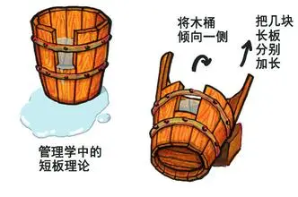

# Work Design 技术体系
### 业务组件化

<br>
<br>

覃明圆

---

* github: github.com/work-design
* gitee: gitee.com/work-design

---
# PPT 使用 markdown 撰写
github.com/marp-team

---
# Work Design 的哲学

---


---
# 长板 vs 短板
当你的长板足够长
你的短板就不再是短板

---
# 进一步提升 Rails 的长板

---
# 降低开发成本
* 写更少的代码
  * DRY(Dont Repeat Yourself)
  * 约定优于配置
  * 继承与覆写（Override）
* 少写代码
  * 代码生成：工具优于约定
  * [元编程](https://github.com/work-design/rails_com/blob/main/app/controllers/com/controller/admin.rb)
<!--
Rails 社区给了答案，我们只需要做的更好
-->
---
# 降低开发门槛
### 需要开发人员掌握的知识尽可能少
* 技术栈尽可能少
  * 前端：拥抱 Hotwire，尽量避免使用 Vue / React 等前端框架
  * 后端：减少库的使用
* DSL 尽可能少：DSL 即学习成本

<!--
只有提升开发效率，提升生产力，才能赚更多的钱。
-->

---
# 降低体系复杂度
### 分而治之

* 基于 Rails Engine 的 MVC 模块化
* 优先模块化，不排斥微服务
  * 微服务：通过 Api 通信，可以是不同的技术栈
  * 模块化（组件化）：同一套技术栈
* 进一步加强模块化
  * UI组件化（View 层）
  * 业务组件化（Model 层）

<!--
Controller 层忽略不计，真的没什么代码

* 业务层面的 DRY
* 在发展中不断完善、不断成熟

如 RailsAuth 中登陆基于 auth_token，相对于 user_id 更安全和支持更多功能
-->

---
# 业务组件化的哲学

* 易用：尽可能减少配置，力求开箱即用
  * 默认提供，即便不用也不会有副作用
* 易插拔：
  * 容易迁移：在项目中引入时，尽量避免改动祖传代码(DefaultForm Vs [SimpleForm](https://github.com/heartcombo/simple_form))
  * 容易移除：尽可能减少沉没成本，移除和替换的时候需要改动的代码也很少（反例[ActionAdmin](https://activeadmin.info)）
* **易覆写（Override）**：反例 Device

<!--
集成：如路由不必 mount
-->
---
# 覆写（Override）
  * Main App 中优先级更高
  * 粒度越细（层级越低）优先级越高
---

* Override Model
* Override View
* Override 其他：
  * Override Controller
  * Override 路由
  * Override Assets
  * Override i18n

---
# 组件化之 Model 层
采用 include 架构

* 易 Override
* 易复用

---
## 定义模型

github.com/work-design/rails_auth/tree/main/app/models/auth

```text
rails_auth
  app
    models
      auth
        user.rb
      user.rb
```

---
# 定义 Model 里的方法
```ruby
# rails_auth/app/models/auth/model/user.rb

module Auth
  module Model::Account
    extend ActiveSupport::Concern
    included do
      attribute :identity, :string
      belongs_to :user
    end

    def send_token
      puts 'implement this in main Application'
    end
  end
end
```

---
# 在 Engine 中定义 Model
```ruby
# rails_auth/app/models/auth/account.rb
module Auth
  class Account < ApplicationRecord
    include Model::Account
  end
end
```

---

# 在 Main App 中 Override
```ruby
module Auth
  class Account < ApplicationRecord
    include RailsAuth::Account
    
    attribute :identity, :integer

    def send_token
      SmsHelper.send(self.identity, '666666')
    end
  end
end
```

<!--
易用：什么都不用干，即可使用现成的 Model
易扩展：易 Override
也提供了一种组织大 model 代码的规范
易理解：很容易知道相应的 model 在哪些 engine 里有定义（`Account.ancestors`）
-->

---
# 工具：Model 层自动迁移
不需要写 Migration：实现了 Django 引以为傲的自动迁移功能
* 使用：`bin/rails g rails_extend:migrations`
* 好处:
  * 只需要在一个地方定义 model 的属性，顺便干了 annotate 的事
  * 方便开发，不用 install migrations，可以放心大胆的去调整 Model
  * 综合传统自动迁移和 migration 的优点

---

定义：
```ruby
class Adminer < ApplicationRecord
  include RailsAuth::User
  belongs_to :user
end
```

运行：
```shell
bin/rails g rails_extend:migrations
```

---
```ruby
class RailsExtendMigration_1 < ActiveRecord::Migration[6.0]
  def change
    create_table :adminers do |t|
      t.string :name
      t.belongs_to :user
      t.timestamps
    end
  end
end
```

---
# 组件化之 View 层

* 数据和排版分离
  * 数据：如 td / th
  * 排版：[tr](https://github.com/work-design/rails_com/blob/main/app/views/application/_index_tr.html.erb)
* 排版与样式分离
  * HTML 负责排版和数据，比 JSON 更灵活先进
  * CSS + JS 负责美
---
# Override View
* 在 Main App 中同路径覆盖
* 基于 _prefixes 

---
# view 查找路径

```ruby
Auth::Panel::UsersController.ancestors
[
  Auth::Panel::UsersController,
  Auth::Panel::BaseController,
  PanelController,
  ApplicationController
]

Auth::Panel::UsersController._prefixes
['auth/panel/users', 'auth/panel/base', 'panel', 'application']
```
---
# _prefixes 自定义

```ruby
class Auth::Panel::UsersController < Auth::Panel::BaseController

  def self.local_prefixes
    [controller_path, 'auth/admin/base']
  end
end
```

---
# View Partial Render 优化
* Rails 默认：
模板名（index) 优先级高于 _prefixes，依据搜索路径匹配到*模板名*符合要求即渲染。如 html 请求，view 目录下没有 index.html.erb，会渲染 index.jbuilder 
* Work Design 优化：
提升了 format 格式的优先级，view 目录下没有 index.html.erb ，就算有 index.jbuilder，也会一级级向上查找只至找到 index.html.erb 才进行渲染

---

# View 提供的默认模板
github.com/work-design/rails_com/tree/master/app/views/application

<!--
https://github.com/work-design/rails_com/tree/master/app/views/application
-->

---
# 示例一：Turbo Stream
```erb
# create.turbo_stream.erb
<%= turbo_stream.prepend 'tbody', partial: 'index_tbody', layout: 'index_tr', locals: { model: instance_variable_get("@#{controller_name.singularize}") } %>
<%= turbo_stream.update 'modal' %>
```

---
# 示例二：Jbuilder
```ruby
# new.json.jbuider / edit.json.jbuilder
json.error model.errors.as_json(full_messages: true)
json.message model.error_text
```

---
# 常规只涉及到增删改查
```
# html
_index/_index_thead.html.erb  # 表头
_index/_index_tbody.html.erb  # 内容
_filter_form.html.erb  # 搜索
_form.html.erb  # 表单
_show_table.html.erb  # 详情页
```

---
# 什么需要被 Override
* 输出（字段、属性）：
  * 增加或减少字段
  * 字段的排版
  * 查询条件(form, item)
* 输入（表单）：
  * Form 表单
* 操作区域
  
---
# Controller
让 Controller 更瘦

---
[常规的 Controller 几乎没有代码](https://github.com/work-design/rails_com/blob/main/app/controllers/com/panel/infos_controller.rb)

```ruby
module Com
  class Panel::InfosController < Panel::BaseController

  end
end
```
---
但是很容易 Override 
```ruby
module Auth
  class Admin::UsersController < Admin::BaseController
    def index
      q_params = {}
      q_params.merge! user_filter_params

      @users = User.default_where(q_params).page(params[:page])
    end

    def create
      @user = User.new(user_params)
      unless @user.join(params)
        render :new, locals: { model: @user }, status: :unprocessable_entity
      end
    end
  end
end
```
---
```ruby
def user_filter_params
  q = params.permit(
    :id,
    'name-like',
    'accounts.identity',
    'last_login_at-desc'
  )
  q.merge! super if defined? super
  q
end

def user_params
  p = params.fetch(:user, {}).permit(
    :name,
    :avatar,
    :password,
    :disabled,
    user_tag_ids: [],
    accounts_attributes: {}
  )
  p.merge! super if defined? super
  p
end
```
---
# Controller 主要干两件事

* 赋值给共享给 View 层的示例变量
  * @users = User.default_where(params)
  * @user = User.new(params)
* View 控制，即 Controller 本身的定位

```ruby
if save
  render 'create'
else
  render 'new'
end
```

---

* 尽可能将业务逻辑交给 Model 层
  * 容易测试
  * Model 就是具备数据持久化的类
* 将控制能力交给 View 层，尽可能移除 redirect_to，也没必要写 respond_to
  * 模板语言的学习成本更低：erb、jbulder
  * View 层 Override 更灵活，更强大

<!--
1. 互动：redirect_to 怎么实现的
2. 在 turbolinks 下是如何实现的
-->
---
# Override Controller

* 像 Model 层一样 Override
  * Main App 中的优先级更高
* 重新定义路由

<!--
1. 直白的说明白路由是干嘛的；
-->
---
```ruby
# In Engine
Rails.application.routes.draw do
  resources :agencies
end

# In Main App
Rails.application.routes.draw do
  resources :agencies, only: [] do
    collection do
      get :search
    end
  end
end
```

---
# Work Design 的前后端分离
* 写 Model 层的程序员
  * 技能发展：Ruby -> ActiveRecord -> 数据库 -> Rails 其他
  * 偏业务方向，注重架构能力
* 写 View 的 程序员
  * 技能发展：HTML + CSS -> 原生 Javascript(Hotwired)
  * 偏交互，更懂用户体验

---
# 让 Rails 更适合小型创业公司

* Work Deisgn “前后端分离” 的意义：
  * 培训 Rails 开发者更容易
  * 可以以更低的成本雇佣开发人员

---
# View 层程序员
* local_variables
* 实例变量：instance_variables - _protected_ivars
* 条件判断和循环
* 可使用的 helper 方法：link_to，button_to 等常用方法
  * link_to 使用 `key: value` 格式([示例](https://github.com/work-design/rails_com/blob/main/app/views/application/_index_tr.html.erb))，更容易让前端开发者理解，也更容易重构
* Form Builder: [default_form](https://github.com/work-design/rails_com/tree/main/lib/default_form)

<!--
谁知道怎么获取自定义的实例变量；
-->
---

# 文档自动化 RailsDoc

* 将 controller 的对象及其属性进行输出


---
# Assets

* vite：https://github.com/work-design/rails_vite
* js / css: 

```
# app/views/auth/panel/users
panel.html.erb
panel.js
```

---
# Override Assets
项目中同路径

---
# Override I18n

* 项目中同路径
* enum 支持：[示例](https://github.com/work-design/rails_com/blob/main/config/locales/zh.enum.yml)

---
# 按业务（Rails Engine）组织代码

* 把关联性更大的代码放到一起
  * 在 model / controller / view 间跳转的频次更高
* 当业务复杂，代码快速增长时
  * 不用 engine：代码全部扔到 models 目录下
  * 用 engine: 业务边界划分要清晰，不然很容易不知道相关业务逻辑应该在哪个 engine
* 使用 RubyMine
  * 读源码更方便
  * 把多个 Engine 放到同一个工作区

---
# Make Rails Great Again!
### 18571856813（微信同号）

# Q & A
